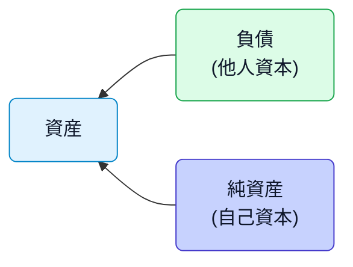
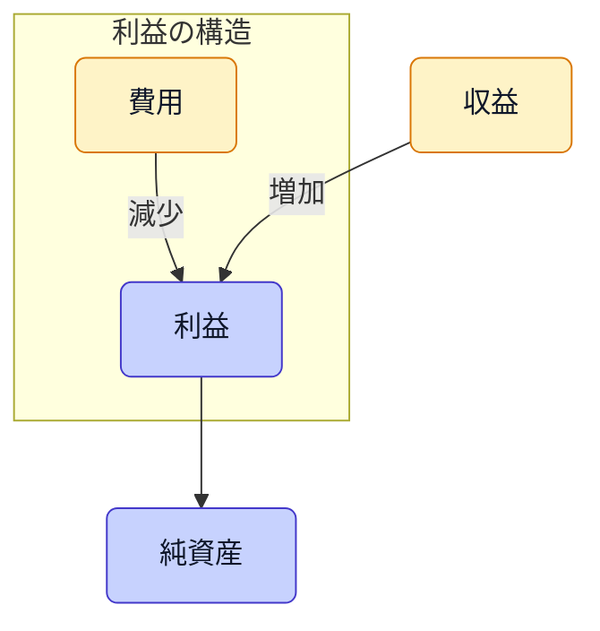

# 会計等式と利益のつながり（A = L + E）

会計の土台は次の2つの等式です。

- 会計等式（バランスシートの骨格）: 資産 = 負債 + 純資産（資本）
- 損益の等式（P/Lの骨格）: 収益 − 費用 = 利益（純資産の増減）

この2つが連動することで、複式簿記の「左右一致」と、期末利益が純資産へ取り込まれる仕組みが成立します。

> [!TIP]
> 等式を意識すると、仕訳の左右や決算整理の考え方が速く・正確になります。

## 1. 会計等式（資産 = 負債 + 純資産）

- 資産: 現金・預金・売掛金・在庫・固定資産など「持っているもの」
- 負債: 買掛金・未払金・借入金など「他人に返すべきもの」
- 純資産: 元入金・事業主借／過去利益の蓄積など「自分の持ち分」

資産は「どこから資金調達したか」（負債か純資産か）の合計と必ず一致します。

## 2. 収益−費用＝利益 → 純資産へ

- 収益が増える・費用が減る → 利益が増え、純資産が増加
- 収益が減る・費用が増える → 利益が減り、純資産が減少（赤字）

期末にP/Lの結果（利益）がB/Sの純資産へ繰り入れられ、翌期の期首残高に反映されます。

## 3. 仕訳と等式の結びつき（直観）

- 借方で増える: 資産・費用
- 貸方で増える: 負債・純資産・収益

例）売上を現金で受け取った

- 借方: 現金（資産↑） / 貸方: 売上（収益↑）
- 収益↑ → 利益↑ → 純資産↑（最終的にB/Sへ取り込まれる）

## 4. 調整（決算整理）と等式

等式は調整仕訳でも崩れません。以下は代表例です。

- 前払費用の計上（費用の繰延べ）
  - 借: 前払費用（資産↑） / 貸: 費用（費用↓）
  - 当期の費用を減らし、将来に繰り延べる → 利益↑ → 純資産↑
- 未払費用の計上（費用の見越し）
  - 借: 費用（費用↑） / 貸: 未払費用（負債↑）
  - 当期の費用を増やし、未払を負債として計上 → 利益↓ → 純資産↓
- 減価償却
  - 借: 減価償却費（費用↑） / 貸: 減価償却累計額（資産の評価減）
  - 利益↓ → 純資産↓。資産と利益の両面で等式が保たれる

> [!NOTE]
> 「発生主義」により、現金の動きとは無関係に収益・費用を期間配分するため、調整仕訳が必要になります。

## 5. エラー検出の観点

- 借方・貸方の合計が一致しない → 仕訳漏れ・二重計上・金額誤り
- B/Sの整合: 資産 = 負債 + 純資産を常に確認（試算表でチェック）
- P/LとB/Sの連動: 期間損益が翌期の純資産へ繰入れているか確認

## 関連リンク

- 五要素と借方貸方: [`../daily-activities/account.md`](../daily-activities/account.md)
- 仕訳の基礎と三分法: [`./journal-entries.md`](./journal-entries.md)
- 月次試算表と検算: [`../what-to-do-every-month/trial-balance.md`](../what-to-do-every-month/trial-balance.md)
- B/SとP/Lの関係: [`../daily-activities/difference-between-balance-sheet-and-income-statement.md`](../daily-activities/difference-between-balance-sheet-and-income-statement.md)
