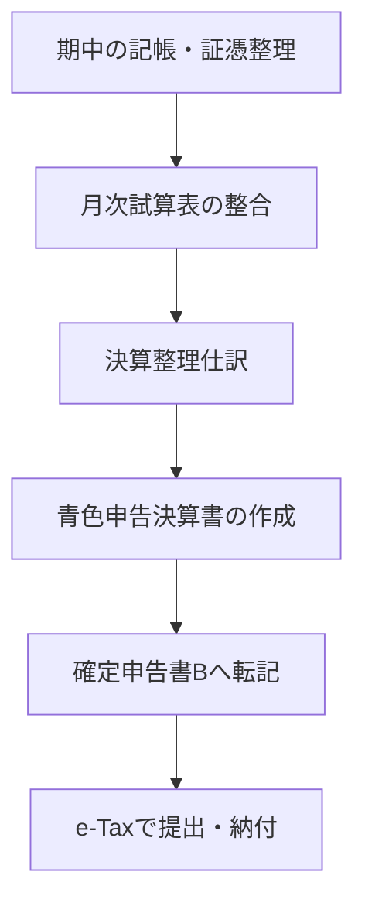

# 青色申告の決算フロー（個人事業主）

青色申告の決算は、**期中の記帳→決算整理→決算書作成→確定申告書提出**の流れで進みます。
このページでは、全体の工程と提出までの作業順を整理します。

## 全体フロー（ざっくり）



> [!TIP]
> 決算書の作成は「試算表が合っているか」に大きく依存します。先に月次の整合を終わらせておくとスムーズです。

## 1. 決算前の準備

```
□ 1年分の証憑を揃える（請求書・領収書・明細）
□ 銀行・クレジット明細を年単位で整理
□ 固定資産台帳を更新（購入・除却）
□ 棚卸がある場合は期末棚卸表を作成
```

## 2. 決算整理仕訳

- 減価償却、前払費用、未払費用、家事按分などを計上
- 必要に応じて棚卸・貸倒引当金を計上

> [!NOTE]
> 決算整理は「実態に合わせた帳簿へ修正する作業」です。期中の仕訳が正しくても、決算整理が漏れると正しい利益になりません。

## 3. 青色申告決算書の作成

作成対象（一般用の基本セット）：

- 損益計算書（売上・売上原価・経費・利益）
- 貸借対照表（資産・負債・資本）
- 減価償却費の計算や売上・仕入の内訳などの明細

> [!IMPORTANT]
> 決算書の金額は、**決算整理後の試算表と一致**している必要があります。

## 4. 確定申告書Bへの転記

- 決算書の「所得金額」を確定申告書Bへ転記
- 所得控除や税額控除を加味して納付税額を計算

## 5. e-Tax提出（概要）

```
□ e-Taxログイン（マイナンバーカード or ID・パスワード）
□ 決算書の入力（または会計ソフトから取り込み）
□ 確定申告書Bの作成
□ 添付書類のアップロード（必要な場合）
□ 送信後に受付結果を確認
```

> [!NOTE]
> 添付が必要な書類は控除の種類で変わります。年によって要件が変わるため、国税庁の案内を確認してください。

## 6. 保存義務

- 帳簿・証憑は**原則7年保存**
- 電子データは検索要件を満たす形で保存

---

## 関連ドキュメント

- [決算整理仕訳](./closing-entries.md)
- [青色申告で必要な帳簿](./types-of-accounting-books.md)
- [月次試算表の作り方と検算手順](../what-to-do-every-month/trial-balance.md)
- [証憑管理（電子帳簿保存法対応の基本）](../reference/document-management.md)
