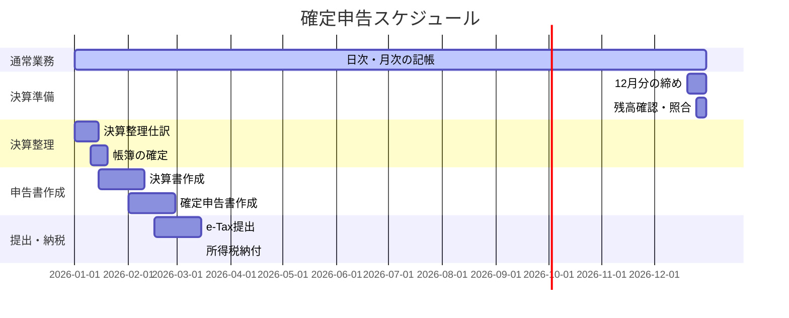

# 確定申告タイムライン

個人事業主の確定申告に向けた**年間スケジュール**をまとめます。
特にIT系フリーランス（青色申告・65万円控除）を想定しています。

> [!TIP]
> 日々の記帳をしっかりやっていれば、年末年始の作業は最小限で済みます。
> 逆に溜め込むと、1〜2月が地獄になります。

---

## 年間スケジュール概要

---

## フェーズ別の作業内容

### Phase 1: 決算準備（12月中旬〜下旬）

**目標：** 12月31日時点の帳簿を完成させる準備

| タスク | 内容 | チェック |
|:-------|:-----|:--------:|
| 12月分の仕訳完了 | 売上・経費・入出金をすべて記帳 | □ |
| 証憑の整理 | 領収書・請求書を月別に整理 | □ |
| 売掛金の確認 | 未入金の請求書を確認 | □ |
| 買掛金の確認 | 未払いの請求書を確認 | □ |
| 現金残高の照合 | 帳簿と実際の現金を一致させる | □ |
| 預金残高の照合 | 帳簿と通帳・ネットバンクを一致させる | □ |
| クレジット明細の確認 | 12月利用分をすべて計上 | □ |

> [!NOTE]
> 12月に届いた請求書で、支払いが1月になるものは「未払金」として計上します。

---

### Phase 2: 決算整理（1月上旬〜中旬）

**目標：** 決算整理仕訳を行い、帳簿を確定させる

| タスク | 内容 | チェック |
|:-------|:-----|:--------:|
| 減価償却費の計算 | 固定資産台帳をもとに計算 | □ |
| 減価償却費の仕訳 | 決算整理仕訳を入力 | □ |
| 前払費用の計上 | 年払いサブスク等の翌期分を繰延べ | □ |
| 未払費用の計上 | 12月分の光熱費・通信費等 | □ |
| 家事按分の確認 | 按分割合と計算根拠を確認 | □ |
| 貸倒引当金（任意） | 必要に応じて計上 | □ |
| 試算表の作成 | 借方・貸方の一致を確認 | □ |

> 詳細は [決算整理仕訳](./closing-entries.md) を参照

---

### Phase 3: 帳簿の確定（1月中旬〜下旬）

**目標：** 仕訳帳・総勘定元帳を確定させる

| 帳簿 | 内容 | チェック |
|:-----|:-----|:--------:|
| 仕訳帳 | 全取引の記録を確定 | □ |
| 総勘定元帳 | 勘定科目別の集計を確定 | □ |
| 固定資産台帳 | 減価償却後の残高を更新 | □ |
| 現金出納帳 | 年間の現金収支を確定 | □ |
| 預金出納帳 | 年間の預金収支を確定 | □ |

---

### Phase 4: 決算書作成（1月下旬〜2月中旬）

**目標：** 青色申告決算書（4ページ）を作成する

#### 青色申告決算書の構成

| ページ | 内容 |
|:-------|:-----|
| 1ページ目 | 損益計算書（売上・経費・所得） |
| 2ページ目 | 月別売上・仕入、給与、地代家賃の内訳 |
| 3ページ目 | 減価償却費の計算、利子割引料の内訳 |
| 4ページ目 | 貸借対照表（資産・負債・純資産）※65万円控除に必須 |

#### 作成のポイント

| 項目 | 確認内容 | チェック |
|:-----|:---------|:--------:|
| 売上金額 | 月別売上の合計が年間売上と一致 | □ |
| 経費の内訳 | 科目別の金額を転記 | □ |
| 減価償却費 | 固定資産台帳と一致 | □ |
| 地代家賃 | 支払先・金額・按分割合を記載 | □ |
| 貸借対照表 | 期首・期末の残高を記載 | □ |
| 青色申告特別控除 | 65万円（e-Tax）or 55万円（紙） | □ |

---

### Phase 5: 確定申告書作成（2月上旬〜下旬）

**目標：** 確定申告書Bを作成する

#### 必要な情報・書類

| 区分 | 書類・情報 | チェック |
|:-----|:-----------|:--------:|
| 所得 | 青色申告決算書（作成済み） | □ |
| 社会保険料控除 | 国民年金の控除証明書 | □ |
| 社会保険料控除 | 国民健康保険の支払額 | □ |
| 生命保険料控除 | 生命保険の控除証明書 | □ |
| 地震保険料控除 | 地震保険の控除証明書 | □ |
| 小規模企業共済 | 掛金払込証明書 | □ |
| iDeCo | 掛金払込証明書 | □ |
| 医療費控除 | 医療費の明細（年間10万円超の場合） | □ |
| ふるさと納税 | 寄附金受領証明書 | □ |
| 源泉徴収 | 支払調書（取引先から届く場合） | □ |

#### 確定申告書の作成方法

| 方法 | メリット | デメリット |
|:-----|:---------|:-----------|
| **e-Tax（推奨）** | 65万円控除、24時間提出可、還付が早い | マイナンバーカード必要 |
| 国税庁サイトで作成→郵送 | 画面で入力できる | 55万円控除、郵送の手間 |
| 手書き→税務署提出 | なし | 計算ミスのリスク、待ち時間 |

> [!IMPORTANT]
> **65万円控除を受けるには e-Tax での提出が必須**です（令和2年分以降）。
> 紙で提出すると控除額が55万円に減額されます。

---

### Phase 6: 提出・納税（2月16日〜3月15日）

#### 提出期限

| 項目 | 期限 |
|:-----|:-----|
| 確定申告書の提出 | **3月15日**（土日の場合は翌月曜） |
| 所得税の納付 | **3月15日** |
| 消費税の申告・納付 | **3月31日**（課税事業者のみ） |

#### 納税方法

| 方法 | 手続き |
|:-----|:-------|
| 振替納税 | 事前に届出、4月中旬に口座引落し |
| e-Taxで納付 | ダイレクト納付、インターネットバンキング |
| クレジットカード | 国税クレジットカードお支払サイト |
| コンビニ納付 | QRコードを発行して支払い |
| 金融機関・税務署 | 納付書を持参 |

> [!TIP]
> **振替納税**がおすすめ。納付期限が約1ヶ月延長され、手続きも不要になります。

---

## 年間カレンダー

| 月 | やること |
|:---|:---------|
| 1月 | 決算整理仕訳、帳簿確定、決算書作成開始 |
| 2月 | 決算書完成、確定申告書作成、e-Tax提出 |
| 3月 | 提出期限（15日）、納税期限（15日） |
| 4月 | 振替納税の引落し（中旬）、翌年度の帳簿開始 |
| 5月 | 住民税・国保の通知が届く |
| 6月 | 住民税の納付開始（普通徴収の場合） |
| 7月 | 所得税の予定納税（1期）※該当者のみ |
| 8月 | - |
| 9月 | - |
| 10月 | 年末調整の準備（従業員がいる場合） |
| 11月 | 所得税の予定納税（2期）※該当者のみ |
| 12月 | 決算準備、残高照合、証憑整理 |

---

## 初年度の注意点

### 開業届・青色申告承認申請

| 届出 | 期限 | 提出先 |
|:-----|:-----|:-------|
| 開業届 | 開業から1ヶ月以内 | 税務署 |
| 青色申告承認申請書 | 開業から2ヶ月以内（または3月15日） | 税務署 |

> [!WARNING]
> 青色申告承認申請書を出し忘れると、その年は白色申告になります。
> 翌年から青色にするには、3月15日までに申請が必要です。

### 初年度の貸借対照表

期首（1月1日）の貸借対照表には、開業時の資産・負債を記載します。

| 科目 | 例 |
|:-----|:---|
| 現金 | 事業用として区分した現金 |
| 普通預金 | 事業用口座の残高 |
| 工具器具備品 | 開業時に持っていたPC等 |
| 元入金 | 上記の合計（資産 - 負債） |

---

## 関連ドキュメント

- [決算整理仕訳](./closing-entries.md)
- [青色申告で必要な帳簿](./types-of-accounting-books.md)
- [月次締めチェックリスト](../what-to-do-every-month/closing-checklist.md)
- [簿記の流れ](../overview/bookkeeping-flow.md)
