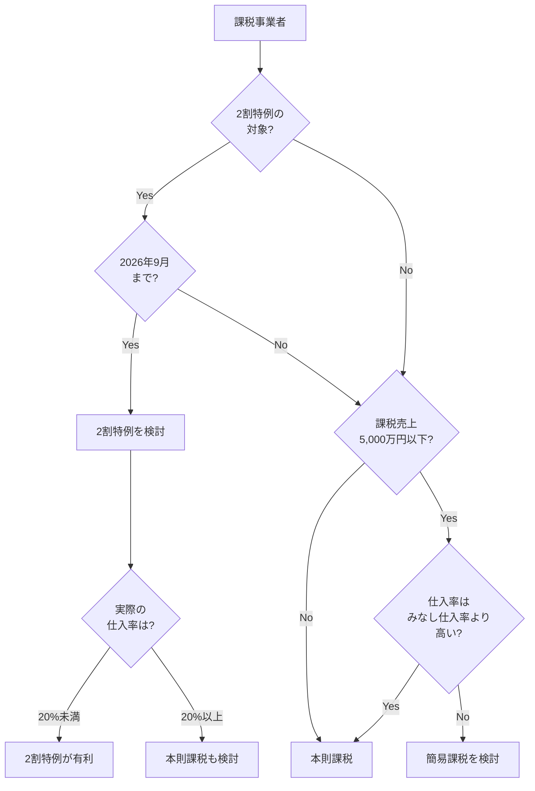
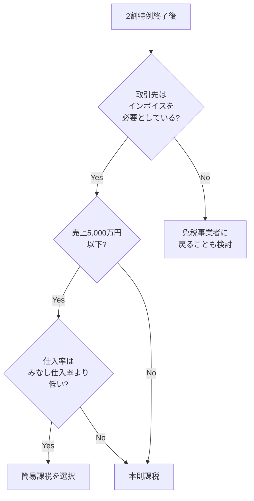

# 消費税の計算方法

消費税の納付額を計算する3つの方法（本則課税・簡易課税・2割特例）を解説します。

## 3つの計算方法の比較

| 方法 | 計算式 | 対象者 | 届出 |
|:---|:---|:---|:---|
| 本則課税 | 売上税額 − 仕入税額 | 全ての課税事業者 | 不要（原則） |
| 簡易課税 | 売上税額 × (1 − みなし仕入率) | 課税売上5,000万円以下 | 必要 |
| 2割特例 | 売上税額 × 20% | インボイス登録で課税事業者になった人 | 不要 |

---

## 本則課税

### 計算方法

```
納付税額 = 売上に係る消費税額 − 仕入に係る消費税額
```

### 特徴

| メリット | デメリット |
|:---|:---|
| 実際の仕入税額を控除できる | 経理が複雑 |
| 還付を受けられる可能性がある | インボイスの保存が必要 |
| 設備投資時に有利 | 計算に手間がかかる |

### 計算例

```
【年間の取引】
売上（税込）: 1,100万円 → 売上税額 100万円
仕入・経費（税込）: 330万円 → 仕入税額 30万円

【納付税額】
100万円 − 30万円 = 70万円
```

### 本則課税が有利なケース

- 仕入や経費が多い（原価率が高い）
- 設備投資を予定している
- 輸出取引がある（還付を受けられる）

---

## 簡易課税

### 計算方法

```
納付税額 = 売上に係る消費税額 × (1 − みなし仕入率)
```

実際の仕入税額ではなく、業種ごとに定められた「みなし仕入率」で計算します。

### みなし仕入率

| 事業区分 | 該当する事業 | みなし仕入率 |
|:---|:---|:---|
| 第1種 | 卸売業 | 90% |
| 第2種 | 小売業、農林漁業（飲食料品） | 80% |
| 第3種 | 製造業、建設業、農林漁業 | 70% |
| 第4種 | 飲食店業、その他 | 60% |
| 第5種 | サービス業（運輸通信、金融保険） | 50% |
| 第6種 | 不動産業 | 40% |

### ITフリーランスの場合

ITフリーランス（システム開発、プログラミング等）は**第5種事業**に該当します。

```
みなし仕入率: 50%
納付税額 = 売上税額 × 50%
```

### 計算例（第5種事業）

```
【年間の取引】
売上（税込）: 550万円 → 売上税額 50万円

【納付税額】
50万円 × (1 − 50%) = 50万円 × 50% = 25万円
```

### 適用要件

| 要件 | 内容 |
|:---|:---|
| 売上基準 | 基準期間の課税売上高が5,000万円以下 |
| 届出 | 「簡易課税制度選択届出書」を提出 |
| 届出期限 | 適用を受けようとする年の前年末まで |
| 継続適用 | 2年間は変更不可 |

> [!WARNING]
> 簡易課税を選択すると、**2年間は本則課税に変更できません**。
> 設備投資の予定がある場合は慎重に判断してください。

### 簡易課税が有利なケース

- 仕入や経費が少ない（サービス業など）
- 経理の手間を減らしたい
- インボイスの管理を簡略化したい

---

## 2割特例

### 概要

インボイス制度を機に免税事業者から課税事業者になった人向けの**経過措置**です。

```
納付税額 = 売上に係る消費税額 × 20%
```

### 適用期間

**2023年10月〜2026年9月**の申告分まで

> [!IMPORTANT]
> 2026年9月で終了予定です。
> 2027年3月の確定申告（2026年分）が最後の適用となります。

### 適用要件

| 要件 | 内容 |
|:---|:---|
| 対象者 | インボイス登録により課税事業者になった人 |
| 売上基準 | 基準期間の課税売上高が1,000万円以下だった |
| 届出 | 不要（確定申告時に選択） |

### 計算例

```
【年間の取引】
売上（税込）: 550万円 → 売上税額 50万円

【納付税額】
50万円 × 20% = 10万円
```

### 2割特例が有利なケース

- 仕入や経費が少ない
- 売上規模が小さい
- 簡易課税の届出をしていない

---

## 3つの方法の比較シミュレーション

### 前提条件

```
年間売上（税込）: 550万円（税抜500万円、消費税50万円）
年間仕入・経費（税込）: 110万円（税抜100万円、消費税10万円）
業種: ITフリーランス（第5種事業）
```

### 計算結果

| 方法 | 計算 | 納付税額 |
|:---|:---|:---|
| 本則課税 | 50万円 − 10万円 | **40万円** |
| 簡易課税 | 50万円 × 50% | **25万円** |
| 2割特例 | 50万円 × 20% | **10万円** |

この例では**2割特例が最も有利**です。

### 仕入が多い場合

```
年間売上（税込）: 550万円（消費税50万円）
年間仕入・経費（税込）: 385万円（消費税35万円）
```

| 方法 | 計算 | 納付税額 |
|:---|:---|:---|
| 本則課税 | 50万円 − 35万円 | **15万円** |
| 簡易課税 | 50万円 × 50% | **25万円** |
| 2割特例 | 50万円 × 20% | **10万円** |

この例でも**2割特例が最も有利**ですが、本則課税も検討の余地があります。

---

## 選択フローチャート



---

## 届出のタイミング

### 簡易課税を選択する場合

```
2026年分から簡易課税を適用したい場合
↓
2025年12月31日までに届出書を提出
```

### 簡易課税をやめる場合

```
2027年分から本則課税に戻したい場合
↓
2026年12月31日までに「簡易課税制度選択不適用届出書」を提出
```

> [!NOTE]
> 簡易課税を選択すると2年間は変更できません。
> 選択不適用届出書を出しても、すぐには本則課税に戻れない場合があります。

---

## 2割特例終了後の対応

2割特例は2026年9月で終了予定です。終了後の選択肢を整理します。

### 2026年10月以降の選択肢

| 選択肢 | 必要な届出 | 届出期限 |
|:---|:---|:---|
| 本則課税 | 不要 | − |
| 簡易課税 | 簡易課税制度選択届出書 | 2026年12月31日 |
| 免税事業者に戻る | インボイス登録取消届出書 | 取消希望日の30日前 |

### 判断のポイント



---

## 消費税の計算ツール

e-shiwakeでは、消費税の集計機能を提供しています。

| 機能 | 内容 |
|:---|:---|
| 課税売上・仕入の集計 | 仕訳から自動集計 |
| 納付税額の計算 | 本則課税ベースで計算 |
| 免税判定 | 課税売上高の確認 |
| 簡易課税の適用可否 | 5,000万円基準のチェック |

> [!TIP]
> e-shiwakeの消費税集計ページで、本則課税の納付税額を確認できます。
> 簡易課税や2割特例との比較は手計算で行ってください。

---

## 関連ドキュメント

- [消費税の基礎知識](./overview.md)
- [課税事業者と免税事業者](./taxable-vs-exempt.md)
- [インボイス制度](./invoice-system.md)
- [消費税関連の仕訳例](./journal-examples.md)
