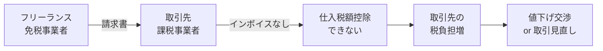

# インボイス制度（適格請求書等保存方式）

2023年10月から始まったインボイス制度について、フリーランス・個人事業主の視点で解説します。

## インボイス制度とは

**適格請求書（インボイス）** を発行・保存することで、消費税の仕入税額控除を受けられる制度です。

### 制度の目的

- 複数税率（10%と8%）に対応した正確な税額計算
- 消費税の適正な転嫁と納税

### 基本ルール

```
買い手（課税事業者）が仕入税額控除を受けるには
↓
売り手が発行した「適格請求書（インボイス）」が必要
↓
インボイスを発行できるのは「適格請求書発行事業者」のみ
↓
登録するには「課税事業者」である必要がある
```

---

## 適格請求書（インボイス）の記載要件

### 必須記載事項

| 項目 | 内容 |
|:---|:---|
| ① 発行者の氏名・名称 | 事業者名 |
| ② 登録番号 | T + 13桁の数字 |
| ③ 取引年月日 | 請求対象の日付 |
| ④ 取引内容 | 商品名・サービス名 |
| ⑤ 税率ごとの合計額 | 10%対象、8%対象それぞれ |
| ⑥ 税率ごとの消費税額 | 端数処理は1請求書につき1回 |
| ⑦ 交付を受ける者の氏名・名称 | 取引先名 |

### 記載例

```
┌─────────────────────────────────────────────┐
│  請 求 書                                    │
│                                             │
│  〇〇株式会社 御中                    ⑦     │
│                                             │
│  下記の通りご請求申し上げます。              │
│                                             │
│  請求日: 2026年1月31日               ③     │
│                                             │
│  ┌───────────────────────────────────────┐  │
│  │ 品目           │ 数量 │ 金額         │  │
│  ├───────────────────────────────────────┤  │
│  │ システム開発費 │  1   │ 500,000円   │④ │
│  │ (10%対象)      │      │             │  │
│  └───────────────────────────────────────┘  │
│                                             │
│  10%対象  500,000円                   ⑤    │
│  消費税額  50,000円                   ⑥    │
│  ─────────────────                          │
│  合計    550,000円                          │
│                                             │
│  山田太郎                             ①    │
│  登録番号: T1234567890123             ②    │
│  住所: 東京都渋谷区...                      │
└─────────────────────────────────────────────┘
```

---

## 登録番号の形式

| 事業者区分 | 番号形式 |
|:---|:---|
| 法人 | T + 法人番号（13桁） |
| 個人事業主 | T + 新規発番（13桁） |

### 登録番号の確認方法

国税庁の「適格請求書発行事業者公表サイト」で確認できます。

- URL: https://www.invoice-kohyo.nta.go.jp/

取引先の登録番号が有効か確認する際に使用します。

---

## フリーランスへの影響

### 取引先が課税事業者の場合



**想定されるシナリオ**:

| パターン | 内容 |
|:---|:---|
| 値下げ要請 | 消費税分（約10%）の値下げを求められる |
| 取引継続 | インボイス登録を条件に取引継続 |
| 取引終了 | 他の課税事業者に切り替え |
| 現状維持 | 経過措置期間中は影響限定的 |

### 取引先が免税事業者・消費者の場合

インボイスは不要なため、影響はほとんどありません。

---

## 経過措置（2029年9月まで）

免税事業者からの仕入れでも、一定期間は仕入税額控除が認められます。

| 期間 | 控除割合 | 実質的な影響 |
|:---|:---|:---|
| 2023/10 - 2026/9 | 80% | 取引先の負担増は約2% |
| 2026/10 - 2029/9 | 50% | 取引先の負担増は約5% |
| 2029/10 - | 0% | 取引先の負担増は約10% |

> [!TIP]
> 経過措置があるため、すぐにインボイス登録しなくても取引への影響は限定的です。
> ただし、2026年10月以降は控除割合が下がるため、早めの検討をおすすめします。

---

## 登録手続き

### 申請方法

| 方法 | 特徴 |
|:---|:---|
| e-Tax | オンラインで完結、最短 |
| 書面 | 税務署に郵送または持参 |

### 申請から登録までの流れ

```
1. 登録申請書を提出（e-Tax or 書面）
   ↓
2. 税務署で審査（約2週間〜1ヶ月）
   ↓
3. 登録通知書が届く
   ↓
4. 登録日から適格請求書を発行可能
```

### 申請に必要な情報

- 氏名・住所
- 事業内容
- 登録希望日（任意）

> [!NOTE]
> 免税事業者がインボイス登録する場合、「課税事業者選択届出書」は不要です。
> 登録申請だけで課税事業者になれます。

---

## 2割特例（少額特例）

### 概要

インボイス制度を機に**免税事業者から課税事業者になった人**向けの経過措置です。

| 項目 | 内容 |
|:---|:---|
| 対象者 | インボイス登録で課税事業者になった人 |
| 適用期間 | 2023年10月 〜 2026年9月の申告分 |
| 計算方法 | 納付税額 = 売上税額 × 20% |

### 適用要件

- 基準期間の課税売上高が1,000万円以下だった
- インボイス登録により課税事業者になった

### 計算例

```
年間売上: 550万円（税込）
売上税額: 50万円

【2割特例の場合】
納付税額 = 50万円 × 20% = 10万円

【本則課税の場合】
納付税額 = 50万円 - 仕入税額（実額）

【簡易課税（第5種）の場合】
納付税額 = 50万円 × 50% = 25万円
```

> [!IMPORTANT]
> 2割特例は**2026年9月で終了**予定です。
> 2026年10月以降は、本則課税または簡易課税を選択する必要があります。

---

## 簡易インボイス（適格簡易請求書）

小売業、飲食業、タクシーなど、不特定多数に販売する事業者向けの簡易版です。

### 通常のインボイスとの違い

| 項目 | 適格請求書 | 適格簡易請求書 |
|:---|:---|:---|
| 交付を受ける者の氏名 | 必要 | 不要 |
| 税率ごとの消費税額 | 必要 | 税率または税額のどちらかでOK |

### 対象業種

- 小売業
- 飲食店業
- 写真業
- 旅行業
- タクシー業
- 駐車場業（不特定多数向け）

---

## 返還インボイス（適格返還請求書）

値引き、返品、割戻しがあった場合に発行します。

### 記載事項

- 返還等の年月日
- 返還等の対象となった取引の内容
- 税率ごとの返還等の金額
- 税率ごとの消費税額

> [!TIP]
> 少額な値引き（税込1万円未満）については、返還インボイスの交付義務が免除されています。

---

## インボイスの保存方法

### 発行側（売り手）

- 交付したインボイスの写しを保存
- 保存期間: 7年間

### 受領側（買い手）

- 受け取ったインボイスを保存
- 保存期間: 7年間
- 電子データで受け取った場合は電子保存が原則

### 電子インボイス

PDFやメールで送付されたインボイスも有効です。

- 電子帳簿保存法の要件を満たす必要あり
- タイムスタンプまたは訂正削除履歴

---

## よくある質問

### Q: 免税事業者のままでいるとどうなる？

A: インボイスを発行できないため、取引先（課税事業者）が仕入税額控除できません。
経過措置期間中は影響が限定的ですが、2029年10月以降は影響が大きくなります。

### Q: 登録をやめることはできる？

A: 可能です。「適格請求書発行事業者の登録取消届出書」を提出します。
ただし、取消後は再登録まで一定期間が必要な場合があります。

### Q: 登録番号を請求書に記載し忘れたら？

A: 適格請求書として認められません。
修正した請求書を再発行するか、不足事項を記載した書類を追加で交付します。

---

## 関連ドキュメント

- [消費税の基礎知識](./overview.md)
- [課税事業者と免税事業者](./taxable-vs-exempt.md)
- [消費税の計算方法](./calculation-methods.md)
- [消費税関連の仕訳例](./journal-examples.md)
