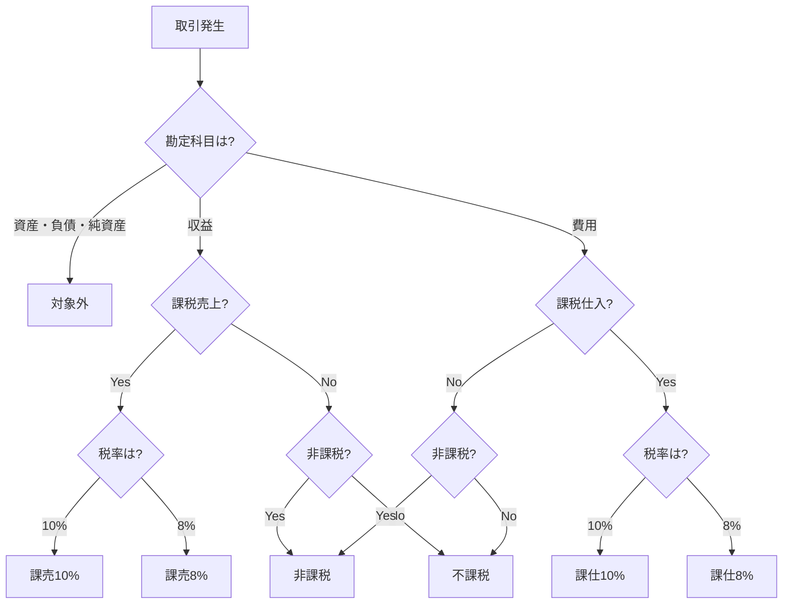

# 消費税関連の仕訳例

消費税の経理処理には「税込経理」と「税抜経理」の2つの方法があります。
それぞれの仕訳パターンを具体例で解説します。

## 税込経理と税抜経理の違い

| 項目 | 税込経理 | 税抜経理 |
|:---|:---|:---|
| 記帳方法 | 消費税を含めた金額で記帳 | 消費税を分けて記帳 |
| 使用科目 | 通常の勘定科目のみ | 仮払消費税・仮受消費税を使用 |
| 経費の金額 | 税込金額が経費になる | 税抜金額が経費になる |
| 向いている人 | 免税事業者、簡易課税選択者 | 本則課税の課税事業者 |
| メリット | 経理が簡単 | 消費税額が明確 |

> [!TIP]
> 個人事業主・フリーランスの場合、**税込経理**が一般的です。
> 税抜経理は経理が複雑になるため、税理士がいる場合や規模が大きい場合に選択されます。

---

## 税込経理の仕訳例

### 課税仕入（消耗品を購入）

消耗品1,100円（税込）を普通預金から支払った。

| 借方 | 金額 | 貸方 | 金額 |
|:---|---:|:---|---:|
| 消耗品費 | 1,100 | 普通預金 | 1,100 |

**消費税区分**: 消耗品費 → 課仕10%、普通預金 → 対象外

### 課税仕入（軽減税率）

会議用のお茶菓子864円（税込・8%）を現金で購入した。

| 借方 | 金額 | 貸方 | 金額 |
|:---|---:|:---|---:|
| 会議費 | 864 | 現金 | 864 |

**消費税区分**: 会議費 → 課仕8%、現金 → 対象外

### 課税売上（売上が入金）

システム開発費110,000円（税込）が普通預金に入金された。

| 借方 | 金額 | 貸方 | 金額 |
|:---|---:|:---|---:|
| 普通預金 | 110,000 | 売上高 | 110,000 |

**消費税区分**: 普通預金 → 対象外、売上高 → 課売10%

### 課税売上（売掛金計上）

コンサルティング料55,000円（税込）の請求書を発行した。

| 借方 | 金額 | 貸方 | 金額 |
|:---|---:|:---|---:|
| 売掛金 | 55,000 | 売上高 | 55,000 |

**消費税区分**: 売掛金 → 対象外、売上高 → 課売10%

### 非課税取引（受取利息）

普通預金に利息5円が入金された。

| 借方 | 金額 | 貸方 | 金額 |
|:---|---:|:---|---:|
| 普通預金 | 5 | 受取利息 | 5 |

**消費税区分**: 普通預金 → 対象外、受取利息 → 非課税

### 不課税取引（固定資産税）

固定資産税10,000円を普通預金から支払った。

| 借方 | 金額 | 貸方 | 金額 |
|:---|---:|:---|---:|
| 租税公課 | 10,000 | 普通預金 | 10,000 |

**消費税区分**: 租税公課 → 不課税、普通預金 → 対象外

### 決算時（消費税の計上）

消費税の納付額50,000円を未払計上する。

| 借方 | 金額 | 貸方 | 金額 |
|:---|---:|:---|---:|
| 租税公課 | 50,000 | 未払消費税 | 50,000 |

> [!NOTE]
> 税込経理の場合、消費税の納付額は「租税公課」として経費になります。
> 還付の場合は「雑収入」として収益になります。

### 消費税の納付

未払消費税50,000円を普通預金から納付した。

| 借方 | 金額 | 貸方 | 金額 |
|:---|---:|:---|---:|
| 未払消費税 | 50,000 | 普通預金 | 50,000 |

---

## 税抜経理の仕訳例

### 課税仕入（消耗品を購入）

消耗品1,100円（税込）を普通預金から支払った。

| 借方 | 金額 | 貸方 | 金額 |
|:---|---:|:---|---:|
| 消耗品費 | 1,000 | 普通預金 | 1,100 |
| 仮払消費税 | 100 | | |

### 課税売上（売上が入金）

システム開発費110,000円（税込）が普通預金に入金された。

| 借方 | 金額 | 貸方 | 金額 |
|:---|---:|:---|---:|
| 普通預金 | 110,000 | 売上高 | 100,000 |
| | | 仮受消費税 | 10,000 |

### 決算時（消費税の精算）

仮受消費税100,000円、仮払消費税30,000円を精算する。

| 借方 | 金額 | 貸方 | 金額 |
|:---|---:|:---|---:|
| 仮受消費税 | 100,000 | 仮払消費税 | 30,000 |
| | | 未払消費税 | 70,000 |

> [!NOTE]
> 税抜経理の場合、消費税の納付額は経費になりません。
> 仮受消費税と仮払消費税の差額が納付額となります。

---

## e-shiwakeでの消費税区分

e-shiwakeでは、仕訳入力時に消費税区分を設定します。

### 消費税区分一覧

| 区分 | 略称 | 用途 |
|:---|:---|:---|
| 課税仕入10% | 課仕10% | 標準税率の仕入・経費 |
| 課税仕入8% | 課仕8% | 軽減税率の仕入 |
| 課税売上10% | 課売10% | 標準税率の売上 |
| 課税売上8% | 課売8% | 軽減税率の売上 |
| 非課税 | 非課税 | 保険料、利息、住宅家賃など |
| 不課税 | 不課税 | 給与、減価償却費、租税公課など |
| 対象外 | 対象外 | 現金、預金、売掛金、買掛金など |

### 勘定科目と消費税区分の対応

| 勘定科目 | デフォルト区分 | 備考 |
|:---|:---|:---|
| 現金 | 対象外 | 支払手段 |
| 普通預金 | 対象外 | 支払手段 |
| 売掛金 | 対象外 | 債権 |
| 買掛金 | 対象外 | 債務 |
| 売上高 | 課売10% | 収益 |
| 仕入高 | 課仕10% | 費用 |
| 消耗品費 | 課仕10% | 費用 |
| 旅費交通費 | 課仕10% | 費用 |
| 通信費 | 課仕10% | 費用 |
| 租税公課 | 不課税 | 税金 |
| 減価償却費 | 不課税 | 非現金費用 |
| 受取利息 | 非課税 | 金融取引 |
| 支払利息 | 非課税 | 金融取引 |
| 事業主貸 | 対象外 | 資本取引 |
| 事業主借 | 対象外 | 資本取引 |

---

## 複合仕訳の例

### 家事按分がある経費

自宅兼事務所の通信費11,000円（税込）を普通預金から支払い、事業用60%を計上。

| 借方 | 金額 | 貸方 | 金額 | 消費税区分 |
|:---|---:|:---|---:|:---|
| 通信費 | 6,600 | 普通預金 | 11,000 | 課仕10% |
| 事業主貸 | 4,400 | | | 対象外 |

### クレジットカード払い

消耗品5,500円（税込）をクレジットカードで購入。

**購入時**:

| 借方 | 金額 | 貸方 | 金額 | 消費税区分 |
|:---|---:|:---|---:|:---|
| 消耗品費 | 5,500 | 未払金 | 5,500 | 課仕10% / 対象外 |

**引落時**:

| 借方 | 金額 | 貸方 | 金額 | 消費税区分 |
|:---|---:|:---|---:|:---|
| 未払金 | 5,500 | 普通預金 | 5,500 | 対象外 / 対象外 |

### 源泉徴収がある売上

報酬110,000円（税込）から源泉徴収税10,210円を差し引いて入金。

| 借方 | 金額 | 貸方 | 金額 | 消費税区分 |
|:---|---:|:---|---:|:---|
| 普通預金 | 99,790 | 売上高 | 110,000 | 対象外 / 課売10% |
| 事業主貸 | 10,210 | | | 対象外 |

> [!NOTE]
> 源泉徴収税は「事業主貸」で処理します。
> 確定申告時に所得税から控除されます。

---

## 消費税区分の判断フロー

---

## よくある間違い

### 間違い1: 預金を課税仕入にする

❌ 間違い:
| 借方 | 貸方 |
|:---|:---|
| 消耗品費（課仕10%） | 普通預金（課仕10%） |

✅ 正解:
| 借方 | 貸方 |
|:---|:---|
| 消耗品費（課仕10%） | 普通預金（対象外） |

> 預金は「支払手段」なので、消費税の課税対象ではありません。

### 間違い2: 租税公課を課税仕入にする

❌ 間違い:
| 借方 | 貸方 |
|:---|:---|
| 租税公課（課仕10%） | 普通預金（対象外） |

✅ 正解:
| 借方 | 貸方 |
|:---|:---|
| 租税公課（不課税） | 普通預金（対象外） |

> 税金は消費税の課税対象外（不課税）です。

### 間違い3: 給与を課税仕入にする

❌ 間違い:
| 借方 | 貸方 |
|:---|:---|
| 給料賃金（課仕10%） | 普通預金（対象外） |

✅ 正解:
| 借方 | 貸方 |
|:---|:---|
| 給料賃金（不課税） | 普通預金（対象外） |

> 給与は雇用契約に基づくもので、消費税の課税対象外です。
> （外注費は課税仕入になります）

---

## 関連ドキュメント

- [消費税の基礎知識](./overview.md)
- [課税事業者と免税事業者](./taxable-vs-exempt.md)
- [インボイス制度](./invoice-system.md)
- [消費税の計算方法](./calculation-methods.md)
- [仕訳の基礎と典型パターン](../basics/journal-entries.md)
