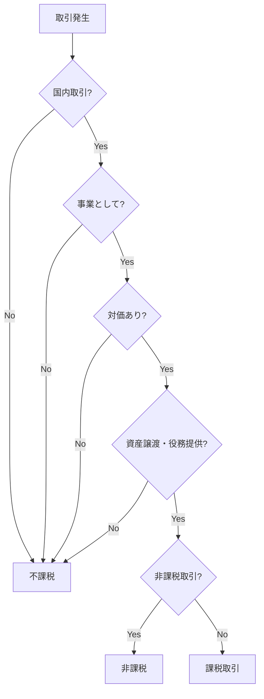
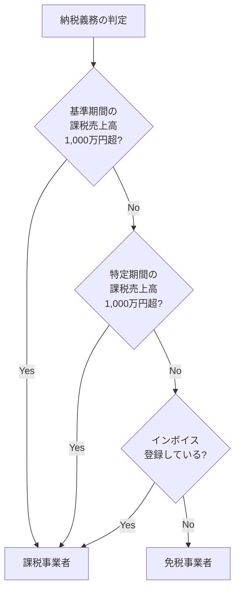

# 消費税の基礎知識

消費税の仕組み、課税対象となる取引、納税義務の判定について解説します。

## 消費税とは

消費税は**間接税**の一種です。最終的な負担者は消費者ですが、納税するのは事業者です。

```
消費者 → 事業者に消費税を支払う
事業者 → 国に消費税を納付する
```

### 税率

| 区分 | 税率 | 内訳 |
|:---|:---|:---|
| 標準税率 | 10% | 国税7.8% + 地方税2.2% |
| 軽減税率 | 8% | 国税6.24% + 地方税1.76% |

### 軽減税率の対象

- 飲食料品（酒類を除く）
- 週2回以上発行される新聞（定期購読契約）

> [!NOTE]
> 外食やケータリングは軽減税率の対象外（10%）です。
> テイクアウトは8%、イートインは10%となります。

---

## 課税対象となる取引

消費税が課税される取引には**4つの要件**があります。

### 国内取引の4要件

1. **国内**において行われる取引
2. **事業者**が事業として行う取引
3. **対価を得て**行う取引
4. **資産の譲渡・貸付け・役務の提供**である



---

## 取引の分類

### 課税取引

消費税が課税される通常の取引です。

| 例 | 税率 |
|:---|:---|
| 商品の販売 | 10%（食品は8%） |
| サービスの提供 | 10% |
| 事務用品の購入 | 10% |
| ソフトウェア開発の受託 | 10% |

### 非課税取引

消費税法で非課税と定められた取引です。

| 取引 | 理由 |
|:---|:---|
| 土地の譲渡・貸付 | 消費されないため |
| 住宅の貸付（居住用） | 社会政策的配慮 |
| 有価証券の譲渡 | 金融取引 |
| 預貯金の利子 | 金融取引 |
| 保険料 | 金融取引 |
| 切手・印紙の譲渡 | 二重課税の排除 |
| 医療費（保険診療） | 社会政策的配慮 |
| 学校の授業料 | 社会政策的配慮 |

### 不課税取引

そもそも消費税の課税対象外の取引です。

| 取引 | 理由 |
|:---|:---|
| 給与・賃金 | 雇用契約に基づく |
| 寄付金・祝金 | 対価性がない |
| 保険金・損害賠償金 | 対価性がない |
| 配当金 | 株主としての地位に基づく |
| 国外取引 | 国内取引ではない |

### 輸出免税

輸出取引は消費税が免除されます（0%課税）。

- 商品の輸出
- 国際輸送
- 非居住者へのサービス提供

> [!TIP]
> 輸出免税は「非課税」とは異なります。
> 輸出免税の場合、仕入税額控除ができるため、還付を受けられる可能性があります。

---

## 納税義務の判定

### 基本ルール

**基準期間**（前々年）の課税売上高で判定します。

| 基準期間の課税売上高 | 納税義務 |
|:---|:---|
| 1,000万円以下 | 免税事業者（原則） |
| 1,000万円超 | 課税事業者 |

### 判定フロー



### 特定期間とは

前年の1月1日〜6月30日の期間です。

- 課税売上高が1,000万円超、かつ
- 給与等の支払額が1,000万円超

の場合、翌年から課税事業者になります。

> [!NOTE]
> 特定期間の判定は、課税売上高の代わりに給与等の支払額で判定することもできます。

---

## 個人事業主の例

### ケース1: 開業1年目

```
2025年10月 開業
2025年の売上 300万円
```

- 基準期間（2023年）: 事業なし → 免税事業者
- ただし、インボイス登録すると課税事業者に

### ケース2: 売上が伸びた場合

```
2024年の売上 800万円
2025年の売上 1,200万円
2026年の売上 ???
```

- 2026年の判定: 基準期間（2024年）の売上800万円 → 免税
- 2027年の判定: 基準期間（2025年）の売上1,200万円 → **課税事業者**

---

## 消費税の申告・納付

### 申告期限

| 区分 | 期限 |
|:---|:---|
| 個人事業主 | 翌年3月31日 |
| 法人 | 事業年度終了後2ヶ月以内 |

### 納付方法

| 方法 | 特徴 |
|:---|:---|
| 振替納税 | 約1ヶ月後に口座引落し（届出必要） |
| e-Tax（ダイレクト納付） | 即時または期日指定で納付 |
| クレジットカード | 手数料あり |
| コンビニ納付 | 30万円以下 |
| 金融機関・税務署 | 現金納付 |

> [!TIP]
> **振替納税**がおすすめです。
> 納付期限が約1ヶ月延長され、手続きも不要になります。

---

## 関連ドキュメント

- [課税事業者と免税事業者](./taxable-vs-exempt.md)
- [インボイス制度](./invoice-system.md)
- [消費税の計算方法](./calculation-methods.md)
- [消費税関連の仕訳例](./journal-examples.md)
