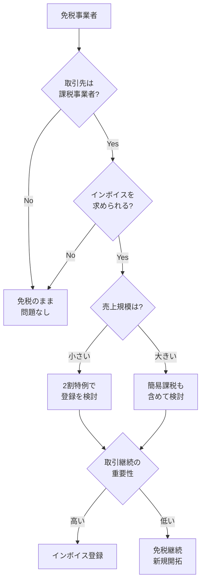

# 課税事業者と免税事業者

消費税の納税義務がある「課税事業者」と、納税義務がない「免税事業者」の違いを解説します。

## 免税事業者とは

**基準期間（前々年）の課税売上高が1,000万円以下**の事業者は、消費税の納税義務が免除されます。

### 免税事業者の特徴

| 項目 | 内容 |
|:---|:---|
| 消費税の納付 | 不要 |
| 消費税の申告 | 不要 |
| 請求書への消費税記載 | 可能（ただしインボイスではない） |
| 仕入税額控除 | 受けられない |
| インボイス発行 | できない |

> [!NOTE]
> 免税事業者でも、取引先に消費税相当額を請求することは可能です。
> ただし、インボイス（適格請求書）は発行できません。

---

## 課税事業者になるケース

以下のいずれかに該当すると課税事業者になります。

### 1. 基準期間の課税売上高が1,000万円超

```
基準期間（前々年）の課税売上高 > 1,000万円
↓
翌々年から課税事業者
```

**例**:
```
2024年の課税売上高: 1,200万円
→ 2026年から課税事業者
```

### 2. 特定期間の課税売上高が1,000万円超

```
特定期間（前年1-6月）の課税売上高 > 1,000万円
かつ
特定期間の給与等支払額 > 1,000万円
↓
翌年から課税事業者
```

### 3. インボイス発行事業者として登録

```
適格請求書発行事業者の登録申請
↓
登録日から課税事業者
```

> [!IMPORTANT]
> インボイス登録は、基準期間の売上高に関係なく課税事業者になります。
> 売上1,000万円以下でも、登録すれば消費税の申告・納付が必要です。

### 4. 課税事業者選択届出書を提出

自ら課税事業者になることを選択できます。

**メリットがあるケース**:
- 設備投資が多く、還付を受けたい
- 輸出取引が多い

---

## 届出書の種類

### 課税事業者になる届出

| 届出書 | 提出期限 | 効力発生 |
|:---|:---|:---|
| 課税事業者選択届出書 | 適用を受けようとする年の前年末 | 翌年1月1日〜 |
| 適格請求書発行事業者の登録申請書 | 随時 | 登録日〜 |

### 免税事業者に戻る届出

| 届出書 | 提出期限 | 効力発生 |
|:---|:---|:---|
| 課税事業者選択不適用届出書 | 免税に戻りたい年の前年末 | 翌年1月1日〜 |
| 適格請求書発行事業者の登録取消届出書 | 取消を受けたい日の30日前 | 届出に記載した日 |

> [!WARNING]
> 課税事業者を選択した場合、**2年間は免税事業者に戻れません**。
> 慎重に判断してください。

---

## 免税事業者のメリット・デメリット

### メリット

| 項目 | 内容 |
|:---|:---|
| 事務負担が少ない | 消費税の申告・納付が不要 |
| 手元資金が増える | 受け取った消費税相当額を納付しなくてよい |
| 経理が簡単 | 税込経理のみでOK |

### デメリット

| 項目 | 内容 |
|:---|:---|
| インボイスを発行できない | 取引先が仕入税額控除できない |
| 取引上の不利 | 値下げ交渉や取引停止のリスク |
| 還付を受けられない | 設備投資しても消費税は戻らない |

---

## 課税事業者のメリット・デメリット

### メリット

| 項目 | 内容 |
|:---|:---|
| インボイスを発行できる | 取引先の信頼を得やすい |
| 仕入税額控除ができる | 支払った消費税を控除できる |
| 還付の可能性 | 設備投資時に還付を受けられる |

### デメリット

| 項目 | 内容 |
|:---|:---|
| 申告・納付の手間 | 毎年の確定申告が必要 |
| 納税負担 | 消費税を納付する必要がある |
| 経理の複雑化 | 消費税区分の管理が必要 |

---

## 判断フローチャート



---

## フリーランスエンジニアの実務

### BtoB取引がメインの場合

取引先が法人（課税事業者）の場合、インボイスを求められることが多いです。

**検討ポイント**:
- 取引先との関係性
- 値下げ交渉の有無
- 2割特例の適用可否

### BtoC取引がメインの場合

消費者相手の取引では、インボイスは不要です。

**例**:
- 個人向けのWebサイト制作
- 個人向けのコンサルティング
- 技術書の執筆（印税）

---

## 経過措置（2029年9月まで）

インボイス制度には経過措置があります。
免税事業者からの仕入れでも、一定割合の仕入税額控除が認められます。

| 期間 | 控除割合 |
|:---|:---|
| 2023年10月 〜 2026年9月 | 80% |
| 2026年10月 〜 2029年9月 | 50% |
| 2029年10月 〜 | 0% |

> [!TIP]
> 経過措置期間中は、免税事業者でも取引への影響が限定的です。
> 2026年10月以降は控除割合が下がるため、それまでに判断が必要です。

---

## 届出のタイミング例

### ケース1: 2026年中にインボイス登録する場合

```
2026年1月〜  登録申請書を提出
登録日〜     課税事業者として取引開始
2027年3月   2026年分の消費税申告（2割特例適用可）
```

### ケース2: 売上増加で強制的に課税事業者になる場合

```
2025年 課税売上高 1,200万円
2026年 引き続き免税事業者（基準期間2023年の売上で判定）
2027年 課税事業者（基準期間2025年の売上1,200万円で判定）
```

---

## 関連ドキュメント

- [消費税の基礎知識](./overview.md)
- [インボイス制度](./invoice-system.md)
- [消費税の計算方法](./calculation-methods.md)
- [消費税関連の仕訳例](./journal-examples.md)
