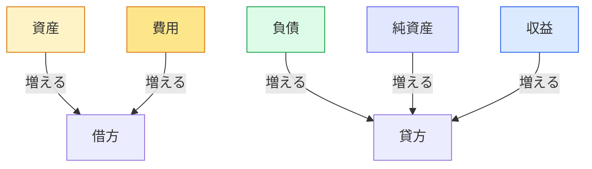
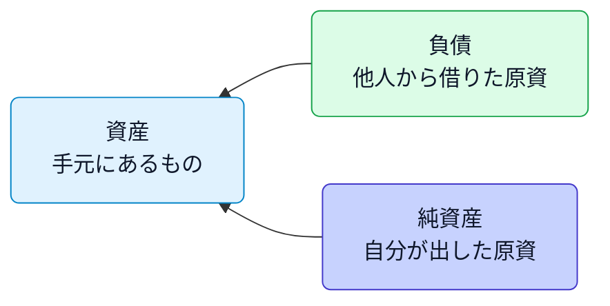
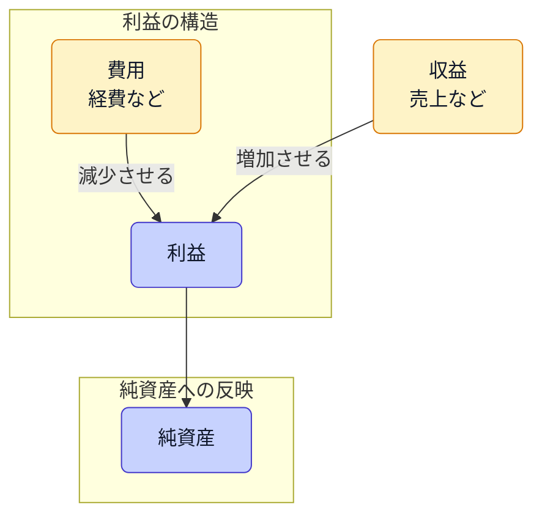

# 簿記の基本構造：5つの勘定科目グループ

簿記の世界では、**すべての取引はこの5分類のどれかに属する** というルールがあります。
これを「簿記五要素」と呼びます。

## 簿記五要素の全体像

| 区分          | 内容                 | 増えるとき | 減るとき  | 主な勘定科目例                     |
| ----------- | ------------------ | ----- | ----- | --------------------------- |
| **資産**      | 事業が持っているお金・モノ・権利   | 借方（左） | 貸方（右） | 現金・預金・売掛金・備品・車両・建物・土地・前払金など |
| **負債**      | 他人に返さなければならない義務・借金 | 貸方（右） | 借方（左） | 買掛金・未払金・借入金・預り金・未払費用など      |
| **純資産（資本）** | 事業主の持ち分・元手         | 貸方（右） | 借方（左） | 元入金・事業主借・事業主貸・繰越利益など        |
| **収益**      | 売上など、資産を増やす取引      | 貸方（右） | 借方（左） | 売上高・受取利息・雑収入など              |
| **費用**      | 経費など、資産を減らす取引      | 借方（左） | 貸方（右） | 仕入・給与・通信費・消耗品費・支払利息・旅費交通費など |

### 借方・貸方の動きで見る

| 勘定グループ | 借方（左側） | 貸方（右側）|
| --- |--- |--- |
| **資産**      | 🟢 増える（＋） 例：現金が入る、備品を購入   | 🔴 減る（−） 例：現金を使う、売掛金が回収される     |
| **負債**      | 🔴 減る（−） 例：借金を返す、未払金を支払う  | 🟢 増える（＋） 例：お金を借りる、後払いが発生      |
| **純資産（資本）** | 🔴 減る（−） 例：事業主が引き出す（事業主貸） | 🟢 増える（＋） 例：事業主が出資する（事業主借・元入金） |
| **収益**      | 🔴 減る（−） 例：売上の取消・返品       | 🟢 増える（＋） 例：売上が発生、受取利息 |
| **費用**      | 🟢 増える（＋） 例：経費を支払う、仕入する   | 🔴 減る（−） 例：費用の戻り・訂正            | 

### ざっくり理解の図

- 💬 左側（借方）は「持っているもの・使ったもの」
- 💬 右側（貸方）は「出どころ・増やした要因」

## 簿記五要素の関係式（超重要）

> **資産 ＝ 負債 ＋ 純資産**
> **収益 − 費用 ＝ 利益（純資産の増加）**

この2つの式を同時に成り立たせるのが「複式簿記」です。
これにより、左右の金額（借方・貸方）は常に一致します。

### 資産・負債・純資産のつながり

- **資産**は事業が持っている現金・モノ・権利など、活動の土台です。
- **負債**は他人資本（借入や後払い）、**純資産**は自己資本（元入金や利益の蓄積）を意味します。
- 事業の資産は、負債と純資産という資金の出どころが必ずペアになっているため、等式が成り立ちます。

> [!NOTE]
> 貸借対照表（バランスシート）はこの式を左右に配置したものです。詳しくは[`daily-activities/difference-between-balance-sheet-and-income-statement.md`](difference-between-balance-sheet-and-income-statement.md)で確認できます。

### 収益・費用が純資産に与える影響

- 収益が費用を上回ると利益が生まれ、その利益が純資産に加算されます。
- 逆に費用が多いと利益が減り、純資産も減少します（赤字の累積）。
- 損益計算書の結果（利益）は翌期の純資産へ繰り入れられるため、両式は会計期間をまたいで連動します。

## 覚え方のゴールデンルール

> * 借方で増えるのは → **資産・費用**
> * 貸方で増えるのは → **負債・資本・収益**

つまり、

> 「左側＝使った・持っているもの」
> 「右側＝その出どころ・稼いだ理由」

| 左（借方）に書くとき         | 右（貸方）に書くとき         |
| -------------------- | --------------------- |
| 資産・費用が **増える**      | 収益・負債・資本（純資産）が **増える** |
| 収益・負債・資本（純資産）が **減る** | 資産・費用が **減る**         |

### この構造を理解すると

* 仕訳を書くとき「どの要素が増減したか？」で瞬時に方向が決まります。
* 会計アプリ（aoiroやfreeeなど）の裏側も、この5要素＋左右ルールで動いています。

## よく使う勘定科目一覧（個人事業主向け）

| グループ    | 科目例                                              |
| ------- | ------------------------------------------------ |
| **資産**  | 現金・普通預金・売掛金・前払金・建物・車両・備品・工具器具備品・立替金              |
| **負債**  | 買掛金・未払金・借入金・預り金・未払費用・前受金                         |
| **純資産** | 元入金・事業主借・事業主貸                                    |
| **収益**  | 売上高・受取利息・雑収入                                     |
| **費用**  | 仕入・外注費・給与手当・通信費・消耗品費・水道光熱費・支払手数料・支払利息・租税公課・旅費交通費 |
