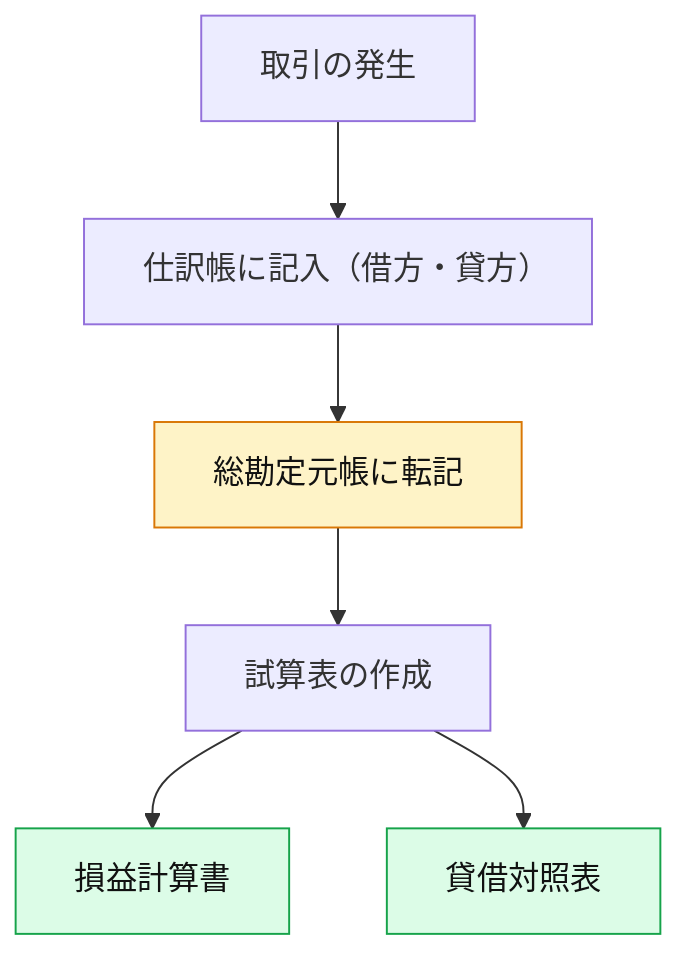

# 貸借対照表と損益計算書の違い

まず、両者は**目的と扱う勘定科目が違う**んです。

| 比較項目       | 貸借対照表（Balance Sheet）       | 損益計算書（Profit & Loss Statement） |
| ---------- | -------------------------- | ------------------------------ |
| **目的**     | 期末時点での**財政状態**を示す          | 1年間の**経営成績（利益）**を示す            |
| **扱う要素**   | 資産・負債・純資産（＝ストック）           | 収益・費用（＝フロー）                    |
| **構造式**    | 資産 ＝ 負債 ＋ 純資産              | 収益 − 費用 ＝ 利益                   |
| **タイミング**  | ある時点（スナップショット）             | 期間全体の動き（動画）                    |
| **主な勘定科目** | 現金・預金・売掛金・備品・買掛金・借入金・元入金など | 売上高・仕入・通信費・水道光熱費・消耗品費・支払利息など   |

## 簿記五要素で分けると

| 五要素 | 属する表  | 例             |
| --- | ----- | ------------- |
| 資産  | 貸借対照表 | 現金・預金・売掛金・備品  |
| 負債  | 貸借対照表 | 借入金・買掛金・未払金   |
| 純資産 | 貸借対照表 | 元入金・事業主借・事業主貸 |
| 収益  | 損益計算書 | 売上高・雑収入       |
| 費用  | 損益計算書 | 経費・減価償却費・支払利息 |

👉 このように「五要素」を2つの表にまとめたのが「決算書」です。

## 総勘定元帳との関係

ここが簿記の中枢です👇

| 概念                | 役割                         | 関係            |
| ----------------- | -------------------------- | ------------- |
| **仕訳帳（Journal）**  | 取引を日付順に記録する帳簿（一次記録）        | 「いつ・何を・いくら」   |
| **総勘定元帳（Ledger）** | 勘定科目ごとに仕訳を整理・集計する帳簿（二次記録）  | 「どの勘定が増減したか」  |
| **試算表**           | 各勘定科目の残高を一覧化して、貸借が合っているか確認 | 「帳簿のバランスチェック」 |
| **貸借対照表・損益計算書**   | 試算表のデータを整理して作成する最終報告書      | 「経営状態の可視化」    |

### 🔹 関係を図にすると

### 流れを言葉でまとめると

> 「仕訳帳」で日々の取引を記録し、
> 「総勘定元帳」で勘定科目ごとに整理し、
> 「試算表」で残高を確認し、
> 「貸借対照表」と「損益計算書」にまとめて報告する。

## まとめ

| ステップ | 帳簿名   | 扱う科目     | 主な目的    |
| ---- | ----- | -------- | ------- |
| 1    | 仕訳帳   | 全科目（五要素） | 取引の記録   |
| 2    | 総勘定元帳 | 各科目ごと    | 勘定残高の把握 |
| 3    | 試算表   | 全科目      | バランス確認  |
| 4    | 貸借対照表 | 資産・負債・資本 | 財政状態を示す |
| 5    | 損益計算書 | 収益・費用    | 経営成績を示す |

