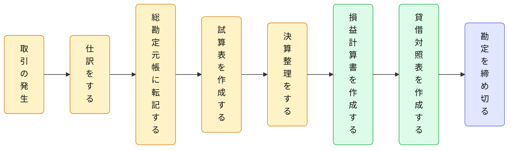
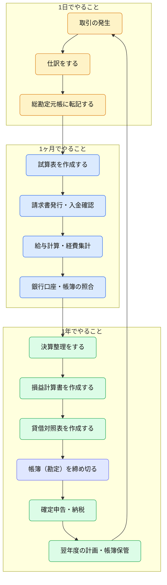

# 簿記の流れ

まず、簿記（個人事業主・小規模事業者を想定）の業務を **「1日」「1ヶ月」「1年」** の周期で整理し、「簿記がどのように財務諸表を導き出すか」という **全体のプロセス（会計の流れ）** を簡潔にまとめたものを提示します。

## 簿記の全体的な流れ（会計サイクル）

| 手順                 | 内容                   |
| ------------------ | -------------------- |
| ① 取引の発生            | 売上・仕入・経費などの経済活動が起こる  |
| ② 仕訳をする            | 勘定科目を使って取引を記録（借方／貸方） |
| ③ 総勘定元帳に転記する       | 各勘定科目ごとに仕訳をまとめる      |
| ④ 試算表を作成する         | 仕訳・転記が正しいか集計して確認     |
| ⑤ 決算整理をする          | 減価償却・未払・前払などを整理する    |
| ⑥ 損益計算書・貸借対照表を作成する | 一期間の利益と財政状態を明らかにする   |
| ⑦ 帳簿（勘定）を締め切る      | 当期を締め、翌期へ繰り越す        |

## 簿記の全体フロー

## 簿記の全体構成

「簿記一巡（会計サイクル）」と「日次・月次・年次業務」を統合した
**簿記全体フロー（会計実務の全体像）** を以下にまとめます。

### 🔹 日次業務（Daily）

* 取引の発生
* 仕訳をする
* 総勘定元帳に転記する

### 🔹 月次業務（Monthly）

* 試算表を作成する
* 請求書発行・入金確認
* 給与計算・経費集計
* 銀行口座・帳簿の照合

### 🔹 年次業務（Yearly）

* 決算整理をする
* 損益計算書・貸借対照表を作成する
* 帳簿（勘定）を締め切る
* 確定申告・納税
* 翌年度の計画・帳簿保管

### 補足説明

| 区分            | 内容                           |
| ------------- | ---------------------------- |
| **取引の発生～仕訳**  | 日常業務の中で生じる取引を、勘定科目と金額で記録     |
| **転記～試算表**    | 仕訳帳の情報を総勘定元帳へ移し、借方・貸方の整合性を確認 |
| **決算整理～財務諸表** | 決算整理仕訳を行い、期間損益と財政状態を確定       |
| **帳簿の締切**     | 翌期へ繰り越し、会計期間を区切る             |

この流れが「**簿記一巡**」とも呼ばれるもので、
このサイクルを**毎期（1年ごと）** 回していくのが会計処理の基本構造です。

## 簿記の全体フロー

この図は「簿記一巡」と「実務サイクル（日・月・年）」を融合した構成になっており、
個人事業主から中小企業レベルまで共通して使える「簿記の全体像」です。

## 解説：全体サイクルの意味

| 段階                     | 内容               | 頻度 |
| ---------------------- | ---------------- | -- |
| **取引の発生 → 仕訳 → 転記**    | 日々の取引を記帳し、帳簿に反映  | 日次 |
| **試算表作成 → 照合・確認**      | 記帳内容の整合性を月ごとに確認  | 月次 |
| **決算整理 → 財務諸表作成 → 締め** | 年間の収支を確定し、翌年度へ繰越 | 年次 |

### 補足

* **日次業務**は「入力精度の確保」が最重要。ここで誤るとすべてに影響。
* **月次業務**は「現状把握」と「資金管理」のフェーズ。
* **年次業務**は「総まとめ」と「税務・戦略立案」のフェーズ。

## 1日でやること（Daily）

| 項目         | 内容                         |
| ---------- | -------------------------- |
| 取引の記録      | 売上・仕入・経費・入出金を帳簿へ記録する（仕訳入力） |
| 領収書・請求書の整理 | 紙・電子を問わず、日付順や科目別に整理        |
| 売上・経費の確認   | 現金・口座・クレジットカードなどの動きを把握     |
| 預金残高の確認    | 通帳またはネットバンキングで残高照合         |
| 仕訳ミスの修正    | 取引内容や金額の誤りをチェックして訂正        |

## 1ヶ月でやること（Monthly）

| 項目           | 内容                 |
| ------------ | ------------------ |
| 月次集計         | 月ごとの売上・仕入・経費・利益を集計 |
| 領収書・請求書の締め処理 | 月末で締め、未処理分を確認      |
| 請求書発行・入金確認   | 顧客への請求書送付・入金チェック   |
| 給与計算・源泉徴収    | 従業員がいる場合の給与・税金処理   |
| 消耗品などの在庫確認   | 棚卸・資産管理の簡易チェック     |
| 銀行口座・帳簿の照合   | 残高と帳簿が一致しているか確認    |

## 1年でやること（Yearly）

| 項目           | 内容                          |
| ------------ | --------------------------- |
| 決算処理         | 1年分の売上・経費を締め、損益計算書・貸借対照表を作成 |
| 固定資産の棚卸・減価償却 | 設備・機器などの年度更新処理              |
| 税務申告         | 確定申告書・青色申告決算書などの提出          |
| 納税・還付処理      | 所得税・住民税などの納付または還付           |
| 翌年度の予算・計画    | 売上目標・経費計画の策定                |
| 帳簿・証憑の保管     | 法定保存期間に従って整理・保管（通常7年）       |

