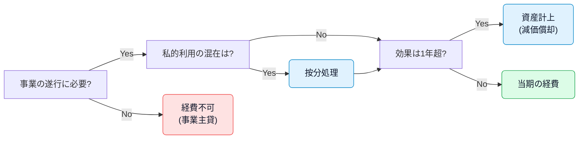

# 勘定科目カタログ（個人事業主・エンジニア向け）

実務で迷わないように、代表的な勘定科目を目的別に整理しました。各項目に定義・よくある取引例・注意点を添えています。

> [!NOTE]
> 消費税の扱い（税抜/税込）や仕訳の左右は、プロジェクトの基本方針（発生主義・税抜基調）に従ってください。詳細は: [`basics/journal-entries.md`](../basics/journal-entries.md)

## 税金関連（租税公課）

- 区分: 費用（租税公課）
- 定義: 国や地方自治体に納める事業関連の税金。
- 例: 印紙税、登録免許税、自動車税（事業用）、固定資産税 など
- 注意: 所得税・住民税・延滞税など「事業主個人の税」は経費になりません（事業主貸）。

## 水道光熱費

- 区分: 費用（インフラ系）
- 例: 電気代、水道代、ガス代
- 注意: 自宅兼事務所の場合は按分。家事按分の根拠（面積・時間など）をメモ。

## 旅費交通費

- 区分: 費用（移動・出張）
- 例: 出張の航空券、タクシー代、ホテル宿泊代、電車・バス代
- 注意: 観光・私的利用は除外。出張日程・目的・行先を摘要に残す。

## 通信費

- 区分: 費用（通信）
- 例: 携帯電話料金、インターネット料金、郵便（切手・はがき）
- 注意: クラウドSaaSは通信費でもよいが、用途により「ソフトウェア使用料」「支払手数料」等も可。プロジェクト内で統一。

## 広告宣伝費

- 区分: 費用（集客）
- 例: パンフ作成、Web広告掲載料、名刺作成費
- 注意: 採用向け・認知向上は広告宣伝費、販売現場での配布物は販売促進費と分けることも。

## 販売促進費

- 区分: 費用（販促）
- 例: ノベルティ制作、キャンペーン費用、展示会出展料
- 注意: 接待交際費と混同に注意（贈答の相手・目的で判断）。

## 接待交際費

- 区分: 費用（交際）
- 例: 取引先との会食、お中元・お歳暮、慶弔見舞金
- 注意: 個人的交際は不可。参加者・目的・先方名を摘要へ。飲食は会議費との線引きに留意。

## 損害保険料

- 区分: 費用（保険）
- 例: 事務所・店舗の火災保険、事業用自動車の任意保険
- 注意: 生命保険等の私的保険は経費不可（または一部のみ）。

## 修繕費

- 区分: 費用（修理・維持）
- 例: 事務所内装の軽微な修繕、機材修理、事業用車両の修理
- 注意: 資産価値を高める大規模な工事は資本的支出（資産計上）に該当する可能性。

## 消耗品費

- 区分: 費用（少額備品）
- 定義: 取得価額10万円未満、または使用可能期間1年未満の備品・用品。
- 例: 文房具、コピー用紙、10万円未満のPC・プリンター
- 注意: 10万円以上は固定資産（減価償却）。少額資産の特例などは税務方針に応じて。

## 減価償却費

- 区分: 費用（固定資産の費用化）
- 例: 車両、機械装置、PC、ソフトウェア等の償却費
- 注意: 取得時は資産計上（備品・工具器具備品・ソフトウェア等）。月次で償却。売却・除却の処理は実例参照。

## 給与賃金・福利厚生費（従業員がいる場合）

- 給与賃金: 給与・賞与・退職金（雇用契約ベース）
- 福利厚生費: 社会保険事業主負担、通勤手当、社内イベント など
- 注意: 個人事業主本人の報酬は経費になりません（事業主貸）。家族従業員は専従者控除等の要件に注意。

## 外注費（エンジニア実務で頻出）

- 区分: 費用（業務委託）
- 例: デザイン・翻訳・開発の外注、清掃委託、クラウドワーカーへの発注
- 注意: 雇用ではなく請負・委任に基づく支出。源泉徴収の要否は業務内容に留意。

## 地代家賃 / 賃借料

- 地代家賃: 事務所・店舗・駐車場の賃料
- 賃借料: 機器・会場・ソフト等のリース/レンタル料
- 注意: 敷金は資産（差入保証金）。リースは会計・税務で扱いが異なる場合あり。

## 会議費

- 区分: 費用（会議関連）
- 例: 打ち合わせ時の飲料代、会議用弁当代
- 注意: 取引先との飲食は金額や内容により交際費になることあり。

## 新聞図書費 / 研究開発費（学習・開発）

- 新聞図書費: 新聞・専門書・技術書・有料記事
- 研究開発費: 市場調査、試作開発、研修・セミナー受講など
- 注意: 資産計上すべき開発支出（ソフトウェア）に該当する場合は固定資産へ。

## 雑費

- 区分: 費用（その他）
- 例: ごみ処理、クリーニング、各種証明書手数料
- 注意: 汎用的に使いすぎない。適正科目があればそちらを優先。

## 売上原価・関連費用（商品売買あり）

- 仕入高: 商品・材料の購入費用（運送料・関税を含める場合あり）
- 荷造運賃: 出荷の梱包・送料
- 三分法による棚卸: 期末繰越商品・期首振替は[`basics/journal-entries.md`](../basics/journal-entries.md)参照

## 信用・金融関連

- 利子割引料: 借入利息、手形割引料
- 貸倒損失: 売掛金・貸付金の回収不能時の損失
- 注意: 借入金元本の返済は費用ではありません（貸借対照表の減少）。

## 車両費

- 区分: 費用（車両維持）
- 例: ガソリン、ETC、車検、オイル、洗車
- 注意: 個人利用分は按分。高速代は旅費交通費で処理するケースもあり、社内方針で統一。

## 取材費（コンテンツ制作・出版等）

- 区分: 費用（制作関連）
- 例: 取材場所の利用料、謝礼、取材交通費
- 注意: 取材目的・媒体名などを摘要で明確化。

## エンジニア特有・IT周辺費用（例）

- ソフトウェア使用料（SaaS）: GitHub、Notion、Figma、Google Workspace など（通信費/支払手数料/ソフト費のいずれかで統一）
- クラウドインフラ: AWS/GCP/Azure 利用料（通信費または外注費・支払手数料）
- ドメイン・SSL: レンタルサーバ・ドメイン費用（通信費または支払手数料）
- 開発機材: キーボード・モニター・USBハブ（消耗品費 or 備品）
- 会議・リモート: オンライン会議ツール有料プラン（通信費）
- 教育・学習: Udemy等の受講料（研究開発費/新聞図書費）

> [!TIP]
> SaaSやクラウドは「通信費」で統一しても問題ありませんが、プロダクト開発の外注は「外注費」、決済手数料は「支払手数料」に分けると分析しやすくなります。

## クイック参照（仕訳の方向）

| 左（借方）に書くとき | 右（貸方）に書くとき |
| --- | --- |
| 資産・費用が増える | 収益・負債・資本（純資産）が増える |
| 収益・負債・資本（純資産）が減る | 資産・費用が減る |

---

## 経費判定のクイックガイド（なる／ならない／按分／資産）

> [!TIP]
> 個人事業主の経費は「事業に必要か」「私的要素はないか」「効果の期間はいつまでか」で判断します。迷ったら摘要に目的を明記し、証憑を保存しましょう。

### 判定フロー（簡易）

### よくある判定例

| 取引 | 区分 | 理由・基準 | 注意 |
| --- | --- | --- | --- |
| 仕事用ノートPC（15万円） | 資産計上→減価償却 | 効果が1年超・取得価額10万円以上 | 少額資産や特例の適用は税務方針に従う |
| モニター（9万円） | 経費（消耗品費） | 少額・1年以内に消耗 | 継続的運用で科目を統一 |
| 自宅の電気代 | 按分（光熱費） | 事業利用部分のみ | 面積・時間等で合理的按分。根拠をメモ |
| 出張時の宿泊・交通 | 経費（旅費交通費） | 事業目的の移動 | 観光等は除外、行程と目的を摘要に |
| 私用スマホの通信料 | 按分（通信費） | 事業利用部分のみ | 明細か利用比率を保管 |
| 名刺・広告バナー制作 | 経費（広告宣伝費） | 集客目的 | 採用向け等の区分は社内で統一 |
| 家族への生活費 | 経費不可（事業主貸） | 私的支出 | 事業と分ける（口座分離推奨） |
| 所得税・住民税 | 経費不可（事業主貸） | 個人の税 | 事業税・固定資産税は経費可（租税公課） |
| 業務委託への支払 | 経費（外注費） | 請負・委任に基づく対価 | 源泉徴収の要否に注意 |
| GitHub / SaaS | 経費（通信費/ソフト使用料） | 事業での利用 | 科目を統一（分析しやすさ重視） |

### 経費にならない代表例（個人事業主）

- 事業主本人の国保・年金・所得税・住民税（事業主貸で処理）
- 罰金・科料・反則金等
- 私的な飲食・旅行・贈答

### グレーゾーンへの対応

- 事業と私用が混在する場合は「按分」。合理的基準（面積、時間、利用回数など）を明示
- 継続性のある支出は「資産計上 or 経費」を一貫した方針で運用（監査・税務での説明容易化）
- 摘要欄に「目的・相手先・期間」を残し、証憑（領収書・契約書・明細）を保管

## 関連リンク

- 五要素の基礎: [`daily-activities/account.md`](../daily-activities/account.md)
- 仕訳の基礎と三分法: [`basics/journal-entries.md`](../basics/journal-entries.md)
- 日次の実践例: [`daily-activities/examples-of-daily-activities.md`](../daily-activities/examples-of-daily-activities.md)
