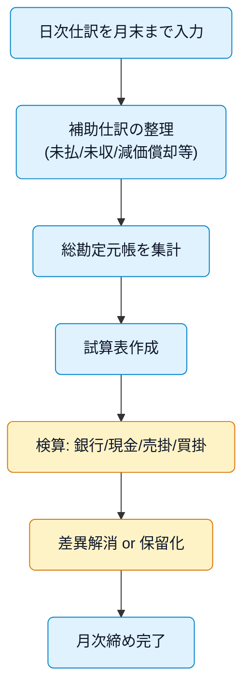

# 月次試算表の作り方と検算手順

月末に日次入力を締め、試算表（各勘定の残高一覧）で借方・貸方の整合を確認します。ここでは、作成ステップと代表的な検算（銀行・現金・売掛・買掛）をまとめます。

## ゴール

- 借方合計＝貸方合計を確認する
- 現金・預金・売掛・買掛など主要勘定の残高が実在の資料と一致
- 未処理・保留がリスト化され翌月へ引き継がれている

> [!IMPORTANT]
> 数字が合っていること（整合）と、数字の中身が正しいこと（実在・網羅）は別物です。必ず証憑・外部資料で突合しましょう。

## フロー（全体像）

## ステップ 1: 前提の整備

- 銀行・クレカフィードを同期し、重複・未分類を解消
- 減価償却、前払・未払など月次仕訳を計上（必要に応じて）
- 証憑（領収書・請求書）を締め、欠落分を回収

関連: [1 ヶ月ごとにやること](./what-to-do-every-month.md)

## ステップ 2: 試算表の作成

- 会計ソフトで総勘定元帳を集計し、試算表を出力
- 借方合計と貸方合計が一致することを確認
- 前月比・前年同月比の主要指標（売上、粗利率、経費率）をメモ

## ステップ 3: 代表的な検算

### 3-1. 預金（銀行口座）の照合

1. 試算表の「普通預金」残高と、月末の通帳残高を比較
2. 差異があれば、未記帳の入出金や未達（振込・引落のタイミング差）を確認
3. 未達は一覧化し、翌月初の通帳で解消を確認

> [!TIP]
> 手数料の自動引落（振込手数料、口座維持手数料など）の記帳漏れが定番の原因です。

### 3-2. 現金の照合

1. 現金出納帳の月末残高と、実際の手持ち現金を数えて一致を確認
2. 差異があれば一時的に「現金過不足」で処理し、翌月に原因を突き止めて修正

### 3-3. 売掛金の照合

1. 取引先別売掛金残高一覧と試算表の売掛金残高を一致させる
2. 期末近辺の請求書と入金日のズレ（締めサイト）をメモ
3. 長期滞留分は与信・回収方針を確認し、必要に応じて貸倒見積の検討（年次）

### 3-4. 買掛金・未払金の照合

1. 取引先別買掛金/未払金残高と試算表の残高を一致させる
2. 請求書受領済みだが未計上のものがないかチェック（経費の漏れ）
3. 翌月の支払予定表に反映

## ステップ 4: 差異の解消と保留

- 仕訳ミスや未記帳を修正し、差異を解消
- 原因不明は「仮勘定」「現金過不足」等で一時処理し、ToDo として翌月に引継ぎ
- 修正内容は「月次メモ」に記録（誰が見ても追えるように）

## チェックリスト（抜粋）

- [ ] 借方合計＝貸方合計
- [ ] 普通預金残高＝通帳残高（未達一覧付き）
- [ ] 現金出納帳残高＝実在現金
- [ ] 売掛金（取引先別合計）＝試算表の売掛金
- [ ] 買掛金・未払金（取引先別合計）＝試算表の買掛/未払
- [ ] 減価償却・前払/未払の月次仕訳を反映
- [ ] 未処理の保留リストを作成

## トラブル事例と対処

- 預金が合わない: 未達/未記帳/二重登録を疑う。月初数日の動きも確認
- 売掛金に謎の残高: 消費税の切り分けや値引の記帳漏れ、相殺処理のミス
- クレカ利用の二重: 利用時未払金＋引落時未払金の消し込み忘れ

## 関連リンク

- 月次全体フロー: [1 ヶ月ごとにやること](./what-to-do-every-month.md)
- 勘定科目と経費判定: [勘定科目カタログ（個人事業主・エンジニア向け）](../reference/chart-of-accounts.md)
- 実務での仕訳パターン: [仕訳の基礎と典型パターン](../basics/journal-entries.md)
